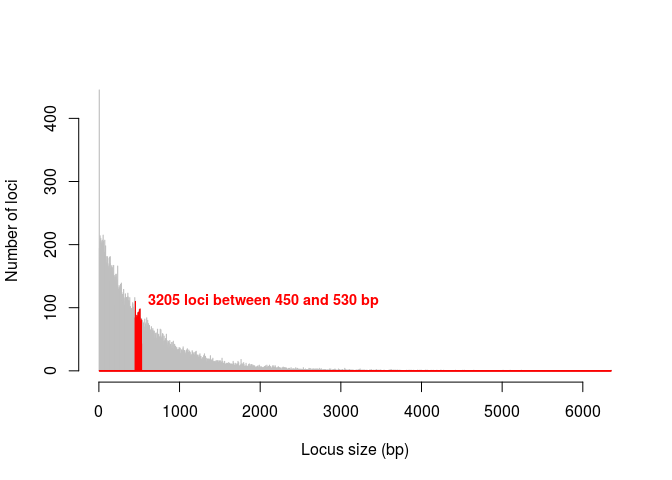

# SimRAD
Celine MO Reisser  
May 9, 2017  


# Using SimRAD to simulate genome-wide digestion


## Genomic specificities

In order to use SimRAD, you should have a global idea of the genome size you want to simulate, as well as its GC content. These values can be directly taken from your species of interest, or from a closely related species that you think share he same geomic characteristics.


It is also inportant to know that SimRAD is limited in the size of the genome it can simulate. For "large" genome (over 500Mb), you can simulate a smaller genome and scale the results to the size of your genome of interest.


In the following example, we will simulate a 100Mb genome of 40%GC, and digest it with one enzyme (hence simulating a classic RADseq expriment) and with two enzyme along with a size selection (simulating a double digestion, ddRAD).


## Install SimRAD package and simulate a dummy genome


```r
#source("https://bioconductor.org/biocLite.R")
#biocLite("Biostrings")
#biocLite("ShortRead")
#install.packages("SimRAD",dependencies=T)

library(SimRAD)

#simulate the genome
simseq <- sim.DNAseq(size=100000000, GCfreq=0.40)
```

## Classical RADseq (single restriction enzyme digestion followed by shearing):

Here we will take the example of a digetion with PstI

```r
#Define the restriction enzyme recognition pattern:
#PstI#
cs_5p1 <- "G"
cs_3p1 <- "AATTC"

#digestion of the "simseq" genome:
simseq.dig <- insilico.digest(simseq, cs_5p1, cs_3p1, verbose=TRUE)
```

```
## Number of restriction sites: 32458
```

Here in the output you can see that the number of restriction sites (and so potential loci) in a 100Mb genome with 40%GC is between 30000 and 35000.Eveerytime you will simulate a new genome, that number of loci will change. This is because each simulation is unique, and as such, the cut sites will slightly vary.

Now if you were to simulate a digestion to take a decision on which set of enzyme to use. For this, you should simulate a genome multiple time and observe the minimum, maximum and average number of loci obtained with that same enzyme. 

For this you can make a loop. Here is an example of a loop with 10 iterations:


```r
x<-c()
for (i in 1:10) {
  simseq <- sim.DNAseq(size=100000000, GCfreq=0.40)
  simseq.dig <- insilico.digest(simseq, cs_5p1, cs_3p1, verbose=F)
  x[i]=length(simseq.dig)-1
}

min<-paste("The minimum number of loci is",min(x),"for a genome of 100Mb and 40% GC.",sep=" ")
max<-paste("The maximum number of loci is",max(x),"for a genome of 100Mb and 40% GC.",sep=" ")
ave<-paste("The average number of loci is", mean(x),"for a genome of 100Mb and 40% GC.",sep=" ")
min
```

```
## [1] "The minimum number of loci is 32263 for a genome of 100Mb and 40% GC."
```

```r
max
```

```
## [1] "The maximum number of loci is 32566 for a genome of 100Mb and 40% GC."
```

```r
ave
```

```
## [1] "The average number of loci is 32424.6 for a genome of 100Mb and 40% GC."
```

This loop allows you to estimate the error around the loci estimation you are producing out of your data.


## ddRAD double restriction enzyme digestion followed by size selection:

Here we will take the example of a double digestion with PstI and MspI, and then selecting fragments having one end with enzyme 1 and end 2 wit enzyme 2, falling between 450bp and 530bp.


```r
#Define the restriction enzyme 1 recognition pattern:
#PstI#
cs_5p1 <- "G"
cs_3p1 <- "AATTC"

#Define the restriction enzyme 2 recognition pattern:
#MspI :  C'CGG
cs_5p2 <- "C"
cs_3p2 <- "CGG"

simseq <- sim.DNAseq(size=100000000, GCfreq=0.40)

#Simulation of the digestion just like before, but by adding the new recognition site
simseq.dig <- insilico.digest(simseq, cs_5p1, cs_3p1, cs_5p2, cs_3p2, verbose=F)

#selecting fragment with ends corresponding to each enzyme: E1--E2 and E2--E1 (versus E1--E1 and E2--E2)
simseq.sel <- adapt.select(simseq.dig, type="AB+BA", cs_5p1, cs_3p1, cs_5p2, cs_3p2)

#selecting the fraction of fragments between 450 and 530bp:
nar.simseq <- size.select(simseq.sel,  min.size = 450, max.size = 530, graph=T, verbose=T)
```

```
## 3205 fragments between 450 and 530 bp
```




Here, and on the graph, you can see that you have around 3100 to 3200 fragments fitting the size category for your ddRAD experiment.

Here as well, everytime you will simulate a new genome, the number will slightly change, and you might want to implement a loop for obtaining min max and average number of loci.


```r
x<-c()
for (i in 1:10) {
  simseq <- sim.DNAseq(size=100000000, GCfreq=0.40)
  simseq.dig <- insilico.digest(simseq, cs_5p1, cs_3p1, cs_5p2, cs_3p2, verbose=F)
  simseq.sel <- adapt.select(simseq.dig, type="AB+BA", cs_5p1, cs_3p1, cs_5p2, cs_3p2)
  nar.simseq <- size.select(simseq.sel,  min.size = 450, max.size = 530, graph=F, verbose=F)
  x[i]=length(nar.simseq)
}

min<-paste("The minimum number of loci is", min(x),"for a genome of 100Mb and 40% GC.",sep=" ")
max<-paste("The maximum number of loci is", max(x),"for a genome of 100Mb and 40% GC.",sep=" ")
ave<-paste("The average number of loci is", mean(x),"for a genome of 100Mb and 40% GC.",sep=" ")
min
```

```
## [1] "The minimum number of loci is 3066 for a genome of 100Mb and 40% GC."
```

```r
max
```

```
## [1] "The maximum number of loci is 3263 for a genome of 100Mb and 40% GC."
```

```r
ave
```

```
## [1] "The average number of loci is 3198.7 for a genome of 100Mb and 40% GC."
```


